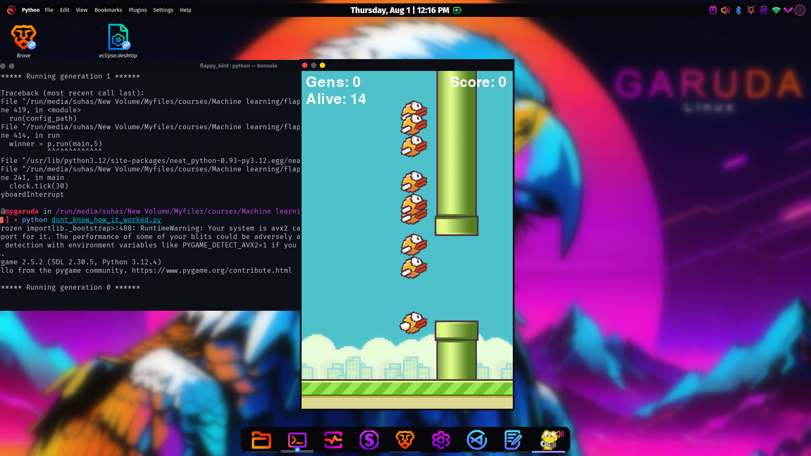

  # NeuroFlap - Genetic Algorithm Game
  
## Overview

NeuroFlap is a Pygame-based game where a NEAT (NeuroEvolution of Augmenting Topologies) genetic algorithm autonomously plays Flappy Bird. The algorithm evolves over generations, enabling the birds to play the game with flawless performance, achieving a 100% success rate in automated gameplay.

## Features

- Autonomous gameplay using the NEAT genetic algorithm.
- Evolving birds over multiple generations for optimal performance.
- Visual representation of game progress, including bird movements, pipes, and score.
- Real-time monitoring of the population, generation count, and score.
- Scalable and customizable NEAT configuration.

## Technologies Used

- **Python**
- **Pygame** for the game's graphical interface.
- **NEAT-Python** for implementing the genetic algorithm.
- 
## How It Works

The NEAT algorithm is used to evolve the birds (agents) in the game. Each bird is controlled by a neural network, and the evolution process optimizes the network's weights to maximize fitness (distance traveled without collisions).

- Birds receive inputs such as their vertical position, the distance to the next pipe, and the gap in the pipe.
- Based on these inputs, the neural network decides whether the bird should jump or continue falling.
- Over generations, the birds improve as the algorithm selects the most successful birds, mutates them, and produces the next generation.

## Installation
1. Clone the repository:
  ```Bash
  git clone https://github.com/yourusername/NeuroFlap.git
  cd NeuroFlap
  ```
2. Install the required dependencies:
  ```bash
  pip install -r requirements.txt
  ```
3. Add your imgs folder with the game assets (bird1.png, pipe.png, base.png, bg.png), or use your own images by modifying the paths.

4. Run the game:
```bash
python neuroflap.py
```
## Configuration
The game uses a NEAT configuration file (config-feedforward.txt) to set various parameters for the genetic algorithm. You can tweak these settings to experiment with different behaviors, such as mutation rates, population size, and more.

## NEAT Algorithm Details
NEAT is a powerful evolutionary algorithm that optimizes neural networks by evolving topology and connection weights. It works by starting with simple networks and gradually adding complexity, which helps avoid premature convergence.

## Gameplay
In the game, multiple birds are initialized, each controlled by its own neural network. As the game progresses, birds that hit pipes or fall below the screen are removed from the population. The fitness function rewards birds for staying alive longer, thus encouraging them to avoid obstacles. The population evolves until all birds can successfully navigate the pipes with a high success rate.

#   Screenshots



## License
This project is licensed under the MIT License. See the LICENSE file for details.
